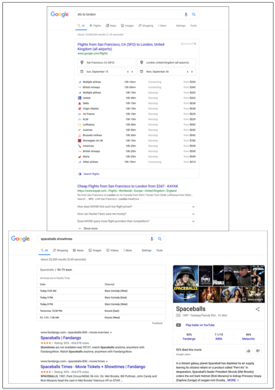
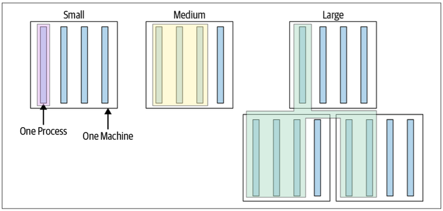
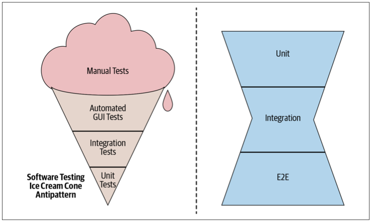

# CHAPTER 11  Testing Overview

Written by Adam Bender

Edited by Tom Manshreck

テストは、常にプログラミングの一部です。実際、あなたが初めてコンピュータ・プログラムを書いたとき、ほとんどの場合、サンプル・データを投げて、期待通りに動作するかどうかを確認したはずです。長い間、ソフトウェアテストの現状は、主に手作業でエラーを起こしやすい、よく似たプロセスになっていた。しかし、2000年代初頭以降、ソフトウェア業界のテストに対するアプローチは、現代のソフトウェアシステムの規模と複雑さに対応するために劇的に進化した。その進化の中心となったのが、開発者主導の自動テストの実践です。

自動化されたテストを行うことで、バグが外に出てユーザーに影響を与えることを防ぐことができます。開発サイクルの後半にバグを発見すればするほど、そのコストは指数関数的に増加します(*1)。 しかし、「バグを発見すること」は動機の一部に過ぎません。ソフトウェアをテストする理由としては、変化に対応する能力をサポートすることも同様に重要です。新しい機能を追加する場合でも、コードの健全性を重視したリファクタリングを行う場合でも、あるいは大規模な再設計を行う場合でも、自動化されたテストはミスを素早く発見することができるので、安心してソフトウェアを変更することができます。

より速く反復できる企業は、技術や市場の状況、顧客の好みの変化に、より迅速に対応することができます。しっかりとしたテストを実施していれば、変化を恐れる必要はありません。ソフトウェア開発に不可欠な品質として、変化を受け入れることができます。システムをより多く、より速く変更したいと思えば思うほど、迅速なテスト方法が必要になります。

テストを書くという行為は、システムの設計を改善することにもなります。コードの最初のクライアントであるテストは、あなたの設計の選択について多くのことを教えてくれます。あなたのシステムは、データベースと緊密に結合しすぎていませんか？APIは必要なユースケースをサポートしているか？システムはすべてのエッジケースに対応しているか？自動化されたテストを書くことで、開発サイクルの早い段階でこれらの問題に直面することになります。そうすることで、よりモジュール化されたソフトウェアとなり、後々の柔軟性を高めることができるのです。

ソフトウェアのテストについては、これまでも多くの議論がなされてきましたが、それには十分な理由があります。Googleでは、長い道のりを歩んできましたが、会社全体でプロセスを確実にスケールアップさせるという難しい問題に直面しています。本章では、この問題を解決するために、私たちが学んだことを紹介します。


## なぜテストを書くのか？

テストを最大限に活用する方法をよりよく理解するために、最初から始めましょう。自動化されたテストといっても、実際には何のことを言っているのでしょうか？
最もシンプルなテストは次のように定義されます。

- テストしたい単一の動作、通常は呼び出しているメソッドやAPI
- 特定の入力、つまりAPIに渡す何らかの値
- 観測可能な出力または動作
- 隔離された単一のプロセスのような制御された環境

このようなテストを実行して、システムに入力を渡し、出力を検証すると、システムが期待通りに動作するかどうかを知ることができます。数百から数千の単純なテスト（通常、テストスイートと呼ばれます）を総合すると、製品全体が意図した設計にどれだけ適合しているか、さらに重要なことに、どのような場合に適合しないかを知ることができます。

健全なテストスイートを作成し、維持するには大変な努力が必要です。コードベースが成長すると、テストスイートも成長します。不安定さや遅さなどの問題に直面するようになります。これらの問題に対処できなければ、テストスイートは機能しなくなります。テストの価値は、エンジニアの信頼から生まれることを覚えておいてください。もしテストが生産性の低下を招き、常に苦労と不確実性を伴うものになってしまったら、エンジニアは信頼を失い、回避策を見つけ始めます。悪いテスト・スイートは、テスト・スイートが全くないよりも悪いかもしれません。

テストは、企業が優れた製品を迅速に構築するために役立つだけでなく、私たちの生活の中で重要な製品やサービスの安全性を確保するためにも重要な役割を果たしています。ソフトウェアはこれまで以上に私たちの生活に密着しており、不具合が発生すると、単なるトラブルにとどまらず、莫大な費用や財産の損失、最悪の場合は人命の損失につながることもあります(*2)。

Googleでは、テストを後回しにしてはいけないと考えています。品質とテストに重点を置くことは、私たちの仕事のやり方の一部です。私たちは、製品やサービスに品質を組み込むことができなければ、必然的に悪い結果を招くことを、時には痛感してきました。その結果、私たちはエンジニアリング文化の中心にテストを組み込んだのです。

### Google ウェブサーバーの物語

Googleの初期には、エンジニア主導のテストはあまり重要ではないと思われていました。チームは、ソフトウェアを正しく動作させるために、常に頭の良い人たちに頼っていました。いくつかのシステムでは大規模な統合テストが行われていましたが、ほとんどはワイルドウェストのような状態でした。その中でも特に問題となっていたのが、「Google Web Server」（通称GWS）という製品でした。

GWSは、Google検索のクエリを提供するWebサーバーで、Google検索にとっては、空港の航空管制のように重要な役割を果たしています。2005年当時、プロジェクトの規模と複雑さが増すにつれ、生産性は劇的に低下していました。リリースにはバグが多く、リリースまでに時間がかかるようになっていました。チームメンバーは、サービスに変更を加えることに自信が持てず、本番で機能が動作しなくなって初めて何か問題があることに気づくことが多かったのです。(ある時は、本番リリースの80％以上にユーザーに影響を与えるバグが含まれており、ロールバックしなければならなかったこともありました。)

これらの問題に対処するため、GWSの技術リーダー（TL）は、エンジニア主導の自動テストという方針を打ち出すことにしました。このポリシーの一環として、すべての新しいコード変更にはテストを含めることが要求され、それらのテストは継続的に実行されることになったのです。この方針を打ち出してから1年で、緊急プッシュの数は半分になった。プロジェクトでは、四半期ごとに記録的な数の新規変更が行われていたにもかかわらず、この減少は起こりました。前例のない成長と変化に直面しても、テストはGoogleで最も重要なプロジェクトの一つに新たな生産性と自信をもたらしました。現在、GWSには何万ものテストがあり、ほぼ毎日リリースが行われているが、顧客の目に見える失敗は比較的少ない。

GWSの変化は、Googleのテスト文化の分岐点となりました。社内の他の部署のチームがテストの利点を知り、同様の戦術を採用するようになったのです。

GWSの経験から得られた重要な洞察の一つは、製品の欠陥を避けるためには、プログラマーの能力だけに頼ることはできないということです。それぞれのエンジニアがたまにしかバグを書かなかったとしても、同じプロジェクトで働く人が多くなれば、増え続ける不具合のリストに振り回されることになります。仮に100人のチームがあったとして、そのチームのエンジニアが非常に優秀で、それぞれが月に1回しかバグを書かないとします。このような優秀なエンジニアが集まっても、毎日5つの新しいバグを生み出しているのです。さらに悪いことに、複雑なシステムでは、エンジニアが既知のバグに適応してその周りをコーディングするため、1つのバグを修正すると別のバグが発生することがよくあります。

最高のチームは、メンバーの知恵を結集してチーム全体の利益につなげる方法を見つけ出します。それが、自動テストの役割です。チームのエンジニアがテストを作成すると、そのテストは他のメンバーが利用できる共通リソースのプールに追加されます。チームの誰もがテストを実行できるようになり、問題が検出されれば利益を得ることができます。一方、デバッグを基本とするアプローチでは、バグが発生するたびにエンジニアがデバッガを使って調査するコストがかかります。エンジニアのリソースにかかるコストは天と地ほどの差があり、これがGWSが運命を好転させることができた根本的な理由です。

### 最新の開発スピードに合わせたテスト

ソフトウェアシステムはますます大規模化し、複雑化しています。Googleの典型的なアプリケーションやサービスは、数千から数百万行のコードで構成されています。何百ものライブラリやフレームワークを使用し、信頼性の低いネットワークを介して、数え切れないほど多くの設定で動作するプラットフォームに配信しなければなりません。さらに悪いことに、新しいバージョンが頻繁に、時には1日に何度もユーザーにプッシュされます。これは、年に1〜2回しかアップデートされなかったシュリンクラップドソフトウェアの世界とはかけ離れています。

人間がシステムのすべての動作を手動で検証する能力は、ほとんどのソフトウェアの機能やプラットフォームの爆発的な増加に追いついていません。航空券の検索、映画の上映時間、関連画像、そしてもちろんウェブ検索結果など、Google検索のすべての機能を手動でテストするには何が必要か想像してみてほしい（図11-1参照）。その問題を解決する方法がわかったとしても、その作業量に、Google Searchがサポートしなければならないすべての言語、国、デバイスを掛け合わせなければならないし、アクセシビリティやセキュリティなどのチェックも忘れてはならない。すべての機能を人間が手動で操作することで製品の品質を評価しようとしても、スケールアップすることはできません。テストに関しては、自動化という明確な答えがあります。



Figure 11-1. 複雑な2つのGoogle検索結果のスクリーンショット

### Write, Run, React

テストの自動化は、純粋な形では、テストの作成、テストの実行、テストの失敗への対応という3つの活動から成り立っています。自動化されたテストとは、テストしたい大規模なシステムの孤立した部分を呼び出す小さなコードであり、通常は1つの関数やメソッドである。テストコードは、期待される環境を設定し、通常は既知の入力を用いてシステムを呼び出し、その結果を検証します。テストの中には、単一のコードパスを使った非常に小規模なものもあれば、モバイルのオペレーティングシステムやウェブブラウザのように、システム全体を対象とした大規模なものもあります。

例11-1では、フレームワークやテストライブラリを使わずに、Javaで意図的にシンプルなテストを行っています。これはテストスイート全体を記述する方法ではありませんが、 自動化されたテストの核心部分はこの非常にシンプルな例に似ています。

Example 11-1. An example test
```C++
// Verifies a Calculator class can handle negative results.
public void main(String[] args) {
   Calculator calculator = new Calculator();
   int expectedResult = -3;
   int actualResult = calculator.subtract(2, 5); // Given 2, Subtracts 5. 
   assert(expectedResult == actualResult);
}
```

かつてのQAプロセスでは、専任のソフトウェアテスターが部屋にこもってシステムの新バージョンを調査し、可能な限りの動作を確認していましたが、今日では、システムを構築するエンジニアは、自らのコードに対して自動テストを書いて実行するという積極的かつ不可欠な役割を担っています。QAが重要な役割を果たしている企業でも、開発者が書いたテストは一般的です。今日のシステム開発のスピードと規模では、テストの開発をエンジニアリングスタッフ全体で共有するしかありません。

もちろん、テストを書くことと、良いテストを書くことは違います。何万人ものエンジニアが良いテストを書けるようにトレーニングするのは、かなり難しいことです。良いテストを書くために学んだことは、この後の章で説明します。

テストを書くことは、自動テストを行う上での最初のステップに過ぎません。テストを書いた後は、それを実行する必要があります。よくあることです。自動テストの基本は、同じ動作を何度も繰り返すことであり、何か問題が発生したときにのみ人間が注意を払う必要があります。この継続的インテグレーション(CI)とテストについては、第23章で説明します。テストを手動の一連の手順ではなくコードとして表現することで、コードが変更されるたびにテストを実行することができます（1日に何千回も簡単に実行できます）。人間のテスターと違って、機械は疲れたり飽きたりすることがありません。

また、テストをコードで表現することで、さまざまな環境で実行できるようにモジュール化しやすいというメリットもあります。例えば、Gmailの動作をFirefoxでテストする場合、Chromeでテストする場合と同じように、両方の環境設定があれば、手間がかかりません(*3)。また、日本語やドイツ語のユーザーインターフェース(UI)のテストも、英語と同じテストコードで実行できます。

開発中の製品やサービスは、どうしてもテストに失敗することがあります。しかし、テストプロセスの有効性を決めるのは、失敗したテストにどう対処するかです。失敗したテストが積み重なると、それまでの価値が失われてしまうので、絶対に避けなければなりません。失敗したテストを数分以内に修正することを優先するチームは、信頼性を高く保ち、失敗を迅速に切り離すことができ、その結果テストからより多くの価値を引き出すことができます。

要約すると、健全な自動テスト文化は、全員がテストを書く作業を共有することを奨励します。このような文化は、テストが定期的に実行されることを保証します。最後に、そしておそらく最も重要なことは、テストの信頼性を高く保つために、壊れたテストを素早く修正することに重点を置くことです。

### コードテストの利点

強力なテスト文化を持たない組織から来た開発者にとって、生産性や速度を向上させる手段としてテストを書くという考えは、相反するものに見えるかもしれません。結局のところ、テストを書くという行為は、そもそも機能を実装するのと同じくらいの時間がかかることがあります。それどころか、Googleでは、ソフトウェアテストに投資することで、開発者の生産性を向上させるいくつかの重要なメリットがあることを発見しました。

- デバッグ作業の軽減
  - 予想されるように、テストされたコードは、提出された時点での欠陥が少なくなります。重要なのは、コードが存在する間中、欠陥が少ないということです。Googleでは、1つのコードが一生の間に何十回も変更されることが予想されます。他のチームや、自動化されたコードメンテナンスシステムによっても変更されるでしょう。一度書かれたテストは、プロジェクトの存続期間中、コストのかかる欠陥や煩わしいデバッグ作業を防ぎ、継続して利益をもたらします。プロジェクトやプロジェクトの依存関係の変更によってテストが壊れることは、テストインフラストラクチャによって素早く検出され、問題が本番にリリースされる前にロールバックされます。
- 変更に対する信頼性の向上
  - すべてのソフトウェアは変更されます。優れたテストを実施しているチームは、プロジェクトの重要な動作がすべて継続的に検証されているため、自信を持ってプロジェクトの変更を検討し、受け入れることができます。このようなプロジェクトは、リファクタリングを促進します。既存の動作を維持しながらコードをリファクタリングする変更は、（理想的には）既存のテストに変更を加える必要はありません。
- ドキュメントの改善
  - ソフトウェアのドキュメントは信頼性が低いことで知られています。時代遅れの要件やエッジケースの欠落など、ドキュメントとコードとの関係が希薄であることはよくあることです。一度に一つの動作を実行する、明確で焦点を絞ったテストは、実行可能なドキュメントとして機能します。特定のケースでコードが何をするのかを知りたければ、そのケースのテストを見ればいいのです。さらに良いことに、要件が変更され、新しいコードが既存のテストを壊してしまった場合、「ドキュメント」が古くなったという明確な信号を得ることができます。なお、テストが文書として最も効果的に機能するのは、テストを明確かつ簡潔に保つように配慮した場合に限られる。
- よりシンプルなレビュー
  - Googleでは、すべてのコードは、投稿する前に少なくとも1人の他のエンジニアによってレビューされます（詳細は第9章を参照）。コードレビューでは、コードの正しさ、エッジケース、エラー条件を示す徹底したテストが含まれていれば、コードが期待通りに動作するかどうかを確認するために費やす労力は少なくて済みます。コードレビューでは、ケースごとにコードを確認する必要がありますが、レビュー担当者は、ケースごとにテストに合格しているかどうかを確認することができます。
- 考え抜かれた設計
  - 新しいコードのテストを書くことは、コード自体のAPI設計を実施するための実用的な手段です。新しいコードのテストが難しい場合、テスト対象のコードの責任が大きすぎたり、依存関係の管理が難しいことが原因であることが多い。適切に設計されたコードは、モジュール化され、緊密な結合を避け、特定の責任に集中するべきです。設計上の問題を早期に解決することは、後の手直しを少なくすることにつながります。
- 迅速かつ高品質なリリース
  - 健全な自動テストスイートがあれば、チームは自信を持ってアプリケーションの新バージョンをリリースすることができます。Googleの多くのプロジェクトでは、毎日新バージョンを本番環境にリリースしています。それは、何百人ものエンジニアがいて、何千ものコード変更が毎日提出されるような大規模なプロジェクトでも同じです。自動化されたテストがなければ、このようなことはできません。

## テストスイートの設計

今日、Google は大規模な事業を展開していますが、昔からそれほど大規模だったわけではなく、私たちのアプローチの基礎はずっと前に築かれました。長年にわたり、コードベースが成長するにつれ、テストスイートの設計と実行のアプローチについて多くのことを学んできました。

かなり早い段階で学んだことの1つは、エンジニアはシステム規模の大きなテストを書くことを好むが、これらのテストは小規模なテストに比べて時間がかかり、信頼性が低く、デバッグが困難であるということでした。システム規模のテストのデバッグにうんざりしたエンジニアたちは、「なぜ一度に1つのサーバーをテストできないのか」「なぜ一度にサーバー全体をテストする必要があるのか」と自問しました。もっと小さなモジュールを個別にテストすればいいのではないか」。最終的には、苦痛を減らしたいという思いから、チームはどんどん小さなテストを開発するようになり、結果的に、より速く、より安定した、そして一般的に苦痛の少ないテストになりました。

これをきっかけに、"small"の正確な意味について、社内では様々な議論がなされました。小さいとはユニットテストのことか？統合テストはどのくらいの規模なのか？私たちは、すべてのテストケースには「サイズ」と「スコープ」という2つの異なる次元があるという結論に達しました。サイズとは、テストケースを実行するのに必要なリソースのことで、メモリ、プロセス、時間などのことです。スコープとは、検証する特定のコードパスのことです。コードを実行することと、そのコードが期待通りに動作することを検証することは異なります。サイズとスコープは相互に関連していますが、異なる概念です。

### テストのサイズ

Google では、すべてのテストをサイズ別に分類し、与えられた機能に対して可能な限り小さなテストを書くようエンジニアに奨励しています。テストのサイズは、コードの行数ではなく、どのように実行されるか、何ができるか、どれだけのリソースを消費するかによって決まります。実際、私たちが定義する小、中、大は、テストインフラがテストに課すことのできる制約として、実際にコード化されているケースがあります。詳細については後ほど説明しますが、簡単に言うと、図11-2に示すように、小テストは単一のプロセスで実行され、中テストは単一のマシンで実行され、大テストは好きな場所で実行されます(*4)。



Figure 11-2. テストサイズ

従来の「ユニット」や「インテグレーション」とは異なり、このような区別をしているのは、テストの範囲に関わらず、テストスイートに求められる最も重要な品質が速度と決定性であるためです。小さなテストは、その範囲に関わらず、より多くのインフラを使用したり、より多くのリソースを消費したりするテストよりも、ほとんどの場合、より速く、より決定性の高いものです。小規模なテストに制限を設けることで、速度と決定性をより簡単に実現することができます。テストの規模が大きくなると、多くの制限が緩和されます。中規模のテストでは、より柔軟性がありますが、非決定性のリスクも高くなります。大規模なテストは、最も複雑で困難なテストシナリオのためだけに保存されます。それでは、それぞれのテストタイプに課せられた制約を詳しく見ていきましょう。

#### 小型テスト

小規模テストは、3つのテストサイズの中で最も制約の多いテストです。主な制約は、小規模なテストは単一のプロセスで実行されなければならないということです。多くの言語では、これをさらに制限して、単一のスレッド上で実行しなければならないとしています。つまり、テストを実行するコードは、テストされるコードと同じプロセスで実行されなければならないのです。サーバーを起動して、別のテストプロセスがそれに接続することはできません。また、データベースのようなサードパーティのプログラムをテストの一部として実行することもできません。

その他の重要な制約として、小型テストでは、スリープやI/O操作(*5)、その他のブロッキングコールを行うことができません。つまり、スモールテストは、ネットワークやディスクにアクセスすることができないのです。このような操作に依存しているコードをテストするには、テストダブルス（第13章参照）を使用して、ヘビーウェイトな依存関係を軽量なプロセス内の依存関係に置き換える必要があります。

これらの制限の目的は、小規模なテストが、テストの速度低下や不確定性の主な原因にアクセスできないようにすることです。単一のプロセス上で実行され、ブロック化された呼び出しを行わないテストは、事実上、CPUが処理できる限り高速に実行することができます。このようなテストを誤って遅くしたり、非決定性にしたりすることは困難です（不可能ではありませんが）。小さなテストに対する制約は、エンジニアが自分で自分を撃つことを防ぐためのサンドボックスになります。

これらの制約は、最初は過剰に思えるかもしれませんが、数百個の小さなテストケースからなるささやかなスイートを1日中実行することを考えてみてください。そのうちの数個でも非決定論的に失敗すると（しばしばフレーキーテストと呼ばれる）、その原因を追究することは生産性を著しく低下させます。Googleの規模では、このような問題が発生すると、テストインフラが停止してしまいます。

Googleでは、テストの範囲にかかわらず、可能な限り小さなテストを書くようエンジニアに奨励しています。これは、テストスイート全体を高速かつ確実に実行するためです。スモールテストとユニットテストの比較については、第12章を参照してください。

#### 中規模テスト

小規模なテストに課せられた制約は、多くの興味深い種類のテストにとってあまりにも制限的です。テストのサイズの次の段階は、中規模テストです。中規模テストでは、複数のプロセスにまたがったり、スレッドを使用したり、localhost に対してネットワークコールを含むブロックコールを行うことができます。唯一の制限は、中規模テストでは localhost 以外のシステムにネットワークコールを行うことができないということです。言い換えれば、テストは1台のマシンの中で行わなければなりません。

複数のプロセスを実行できるようになったことで、さまざまな可能性が広がりました。例えば、データベースインスタンスを実行して、テストしているコードが正しく統合されているかどうかを、より現実的な環境で検証することができます。また、Web UIとサーバーコードの組み合わせをテストすることもできます。Webアプリケーションのテストでは、WebDriverのようなツールを使って実際のブラウザを起動し、テストプロセスを介してリモートで制御することがよくあります。

残念ながら、柔軟性が高まると、テストが遅くなったり、非決定論的になったりする可能性が高まります。プロセスをまたいだり、ブロックコールを許可されているテストは、OSやサードパーティのプロセスに高速性や決定性を依存しており、一般的に保証できるものではありません。中程度のテストであれば、ネットワーク経由でのリモートマシンへのアクセスを防ぐことで、多少の保護はできます。ネットワークは、ほとんどのシステムで遅さや非決定性の最大の原因となっています。しかし、中程度のテストを書くときには、「安全性」は失われており、エンジニアはより慎重になる必要があります。

#### 大型テスト

最後に、大規模テストについて説明します。大規模テストでは、中規模テストで課されていたローカルホストの制限がなくなり、テストとテスト対象のシステムが複数のマシンにまたがることができます。例えば、リモート クラスタ内のシステムに対してテストを実行することができます。

前述の通り、柔軟性の向上はリスクの増加を伴います。複数のマシンとそれらをつなぐネットワークにまたがるシステムを扱わなければならないため、単一のマシン上で実行する場合に比べて、速度低下や不確定性が発生する可能性が大きくなります。大規模なテストは、コードよりも構成を検証することに重点を置いたフルシステムのエンドツーエンドのテストや、テストダブルが使用できないレガシーコンポーネントのテストなどに使用します。大規模テストの使用例については、第14章で詳しく説明します。Google のチームでは、大規模なテストを小規模なテストや中規模なテストから分離し、 開発者のワークフローに影響を与えないようにするために、 ビルドやリリースのプロセスでのみ実行することがよくあります。

----

### ケーススタディ フレークテストはコストがかかる

もし数千ものテストがあって、それぞれがほんの少しの非決定性を持っていて、 それを一日中走らせていたら、たまには失敗することもあるでしょう (フレーク)。テストの数が増えれば、統計的にフレークの数も増えます。もし各テストが0.1%でも失敗する可能性があり、1日に10,000個のテストを実行した場合、1日に10個のフレークを調査することになります。それぞれの調査は、あなたのチームができるもっと生産的なことから時間を奪います。

場合によっては、テストが失敗したときに自動的に再実行することで、不具合のあるテストの影響を抑えることができます。これは事実上、CPU サイクルとエンジニアリングの時間を交換することになります。不具合のレベルが低い場合、このトレードオフは理にかなっています。ただし、テストの再実行は、不具合の根本的な原因に対処する必要性を先延ばしにしているだけであることに留意してください。

テストのフレークが増え続けると、生産性の低下よりもはるかに悪いことが起こります。それは、テストに対する信頼の喪失です。チームがテスト・スイートに対する信頼を失うまでには、多くのフレークを調査する必要はありません。そうなると、エンジニアはテストの失敗に反応しなくなり、テスト・スイートが提供していた価値がなくなってしまいます。私たちの経験では、フレーク率が1％に近づくと、テストの価値が失われ始める。Googleでは、フレーク率は0.15%前後で推移しており、これは毎日何千ものフレークが発生していることを意味しています。Googleでは、フレークの発生を抑えるために、エンジニアが積極的にフレークの修正に時間を割くなどの努力をしています。

ほとんどの場合、フレークはテスト自体の非決定論的な動作が原因で発生します。ソフトウェアには、クロックタイム、スレッドスケジューリング、ネットワークレイテンシーなど、多くの非決定性の原因があります。ランダム性の影響を分離し、安定化させる方法を学ぶことは容易ではありません。時には、ハードウェアの割り込みやブラウザのレンダリングエンジンなど、低レベルの問題に結びつくこともあります。優れた自動テストインフラは、エンジニアが非決定論的な動作を特定し、それを軽減するのに役立つはずです。

----

#### すべてのテストサイズに共通する特性

すべてのテストは密閉型であるように努めなければなりません。テストには、その環境をセットアップし、実行し、破壊するために必要なすべての情報が含まれていなければなりません。テストは、テストを実行する順番など、 外部環境についてできる限り想定しないようにしなければなりません。例えば、テストは共有データベースに依存すべきではありません。この制約は、大規模なテストになるほど難しくなりますが、それでも隔離性を確保するための努力は必要です。

テストには、問題となっている動作を実行するのに必要な情報だけを含めるべきです。テストを明確かつシンプルにすることで、コードがその通りに動作するかどうかを確認することができます。また、明確なコードは、失敗したときの診断にも役立ちます。私たちは、"テストは一目瞭然でなければならない "と言っています。テスト自体にはテストがないので、正しさを確認するためには手動でのレビューが必要になります。これに付随して、私たちはテストに条件分岐やループなどの制御フロー文を使用することも強く推奨しません。テストの流れが複雑になると、それ自体にバグが含まれる危険性がありますし、 テストの失敗の原因を突き止めるのが難しくなります。

テストが見直されるのは、何かが壊れたときだけであることを忘れないでください。今まで見たこともないような壊れたテストを修正するように言われたとき、誰かが時間をかけて理解しやすくしてくれたことに感謝するでしょう。コードは書かれるよりも読まれることの方がはるかに多いのですから、自分が読まれたいと思うテストを書くようにしましょう。

**テストサイズの実際**
テストサイズを正確に定義することで、それを実施するためのツールを作成することができました。これにより、テストスイートを拡張しても、速度、リソース使用率、安定性について一定の保証を行うことができるようになりました。Googleでは、これらの定義をどの程度実施しているかは、言語によって異なります。例えば、Google ではすべての Java テストを独自のセキュリティ マネージャを使用して実行しています。このセキュリティ マネージャは、ネットワーク接続の確立などの禁止事項を実行しようとした場合、小さいとタグ付けされたすべてのテストを失敗させます。

### テストスコープ

Googleではテストサイズを重視していますが、もう一つの重要な特性としてテストスコープを考慮する必要があります。テストスコープとは、あるテストでどれだけのコードが検証されているかということです。狭い範囲のテスト (一般に「ユニットテスト」と呼ばれます) は、個々のクラスやメソッドのような、コードベースの小さな集中した部分のロジックを検証するように設計されています。中規模テスト (一般に統合テストと呼ばれる) は、少数のコンポーネント間の相互作用を検証するために設計されています。大規模なテスト (機能テスト、エンドツーエンドテスト、システムテストなどの名称で呼ばれる) は、システムのいくつかの異なる部分の相互作用や、単一のクラスやメソッドでは表現されない出現する動作を検証するように設計されています。

注意すべき点は、ユニットテストのスコープが狭いということは、実行されるコードではなく、検証されるコードに言及しているということです。あるクラスが多くの依存関係を持っていたり、他のクラスを参照していたりすることはよくあることで、これらの依存関係は対象となるクラスのテスト中に自然に呼び出されます。他のテスト戦略では、テスト対象のシステムの外にあるコードの実行を避けるために、テストの替え玉（フェイクやモック）を多用するものもありますが、Google では、実行可能な場合は実際の依存関係を維持することを推奨しています。第13章では、この問題についてさらに詳しく説明します。

狭い範囲のテストは小さく、広い範囲のテストは中規模または大規模になる傾向がありますが、これは必ずしもそうではありません。たとえば、サーバーのエンドポイントに対して 広範な範囲のテストを書くことは可能です。 このテストでは、通常の構文解析やリクエストの検証、 ビジネスロジックをすべてカバーしていますが、 データベースやファイルシステムなどのプロセス外の依存関係を すべてダブルスで代用しているため、規模は小さくなります。同様に、中規模でなければならない単一のメソッドに対して、狭い範囲のテストを書くことも可能です。たとえば、最近のウェブフレームワークでは HTML と JavaScript が一緒になっていることが多く、日付選択ツールのような UI コンポーネントのテストでは、単一のコードパスを検証するためにもブラウザ全体を実行しなければならないことがよくあります。

Googleでは、小さいサイズのテストを推奨しているように、エンジニアにも狭い範囲のテストを書くことを推奨しています。大まかな目安としては、ビジネスロジックの大部分を検証する範囲の狭いユニットテストが80％、2つ以上のコンポーネント間のやり取りを検証する範囲の広い統合テストが15％、そしてシステム全体を検証するエンドツーエンドのテストが5％という構成にしています。図11-3は、これをピラミッド型にしたものです。


Figure 11-3. Mike Cohn氏のテストピラミッドのGoogle版。(*6) パーセンテージはテストケース数で、チームごとに構成は少しずつ異なる。


ユニットテストは、高速で安定しており、クラスや関数が持つ可能性のあるすべての動作を特定するために必要な範囲を劇的に狭め、認知的な負荷を減らすことができるため、優れた基盤となります。さらに、ユニットテストは失敗の診断を迅速かつ無痛で行うことができます。注意すべき2つのアンチパターンは、図11-4に示すように、「アイスクリーム・コーン」と「砂時計」です。

アイスクリームコーンの場合、エンジニアはエンドツーエンドのテストをたくさん書きますが、統合テストやユニットテストはほとんど書きません。このようなスイートは、時間がかかり、信頼性が低く、作業がしにくい傾向があります。このパターンは、プロトタイプとしてスタートし、すぐに製品化を急ぐプロジェクトでよく見られ、テストの負債に対処するために停止することはありません。

砂時計は、多くのエンドツーエンドのテストと多くのユニットテストを含みますが、統合テストはほとんどありません。アイスクリームコーンほどひどくはありませんが、それでもエンド・ツー・エンドのテストで多くの失敗が発生し、中規模のテストであればもっと早く簡単に発見できたはずです。砂時計パターンは、緊密な結合により、個々の依存関係を分離してインスタンス化することが困難な場合に発生します。



Figure 11-4. テストスイートのアンチパターン

私たちが推奨するテストの組み合わせは、エンジニアリングの生産性と製品の信頼性という2つの主要な目標によって決まります。ユニットテストを優先することで、開発プロセスの早い段階で高い信頼性を得ることができます。大規模なテストは、製品が開発される際の健全性をチェックするためのものであり、バグを発見するための主要な手段と見なすべきではありません。

あなた自身の組み合わせを考えると、異なるバランスが必要になるかもしれません。統合テストを重視した場合、テストスイートの実行には時間がかかるが、コンポーネント間の問題をより多く捕捉できることがわかるかもしれない。ユニットテストを重視した場合、テストスイートは非常に早く完了し、一般的なロジックのバグを多く検出することができます。しかし、ユニットテストでは、異なるチームが開発した2つのシステム間の契約のような、コンポーネント間の相互作用を検証することはできません。優れたテストスイートには、アーキテクチャや組織の現実に適した、さまざまなテストのサイズとスコープが混在しています。

### ビヨンセの法則

新入社員を指導する際に、どのような行動や特性を実際にテストする必要があるのか、という質問をよく受けます。率直な答えは、「壊したくないものはすべてテストする」です。言い換えれば、あるシステムが特定の動作をすることを確信したい場合、それを確認する唯一の方法は、そのための自動テストを書くことです。これには、パフォーマンス、動作の正しさ、アクセシビリティ、セキュリティのテストなど、一般的なものがすべて含まれます。また、システムが障害をどのように処理するかをテストするような、目立たない特性も含まれます。

私たちは、この一般的な考え方を「ビヨンセ・ルール」と呼んでいます。簡潔に言うと、次のようになります。"If you like it, then you shoulda put a test on it." ビヨンセ・ルールは、コードベース全体の変更に責任を持つインフラストラクチャ・チームでよく唱えられます。関連性のないインフラストラクチャの変更がすべてのテストに合格しても、チームの製品が壊れてしまった場合、あなたはそれを修正し、追加のテストを追加する責任があります。

----

### 故障を想定したテスト

システムが考慮しなければならない最も重要な状況の一つは、失敗です。失敗は避けられませんが、システムが大惨事にどれだけ対応できるかを調べるために、実際の大惨事を待つのは苦痛のもとになります。失敗を待つのではなく、一般的な種類の失敗をシミュレートする自動テストを書きましょう。これには、ユニットテストにおける例外やエラーのシミュレーション、統合テストやエンドツーエンドテストにおけるRPC（Remote Procedure Call）のエラーや遅延の注入などが含まれます。また、カオスエンジニアリングのような技術を用いて、実際の本番ネットワークに影響を与えるような大規模な障害を含めることもできます。悪条件に対する予測可能で制御された応答は、信頼性の高いシステムの特徴です。

----

### コードカバレッジについて

コードカバレッジとは、機能コードのどの行がどのテストによって実行されたかを示す指標です。100 行のコードがあり、そのうちの 90 行をテストが実行した場合、コードカバレッジは 90% となります(*7)。 コードカバレッジはテストの品質を理解するための金字塔のように語られることがありますが、これは少々残念なことです。多くのコードラインをいくつかのテストで実行することは可能ですが、それぞれのラインが何か有用なことをしているかどうかはチェックできません。これは、コードカバレッジが、ある行が呼び出されたことを測定しているだけで、その結果何が起こったかを測定していないからです。(大規模なテストを実行したときに発生するカバレッジの膨張を避けるために、小さなテストでのみカバレッジを測定することをお勧めします)。

コードカバレッジのさらに厄介な問題は、他の測定基準と同様に、すぐにそれ自体が目標となってしまうことです。例えば、80% というように、期待されるコードカバレッジの基準を設定することがよくあります。最初は、それは非常に合理的に聞こえます。確かに、少なくともその程度のカバレッジは欲しいものです。実際には、80％を床のように扱うのではなく、エンジニアが天井のように扱うことになります。やがて、80％以上のカバー率でないと変更ができなくなってしまいます。結局のところ、指標が要求する以上の仕事をする必要はないのです。

テストスイートの品質にアプローチするためのより良い方法は、テストされる動作について考えることです。顧客が期待する動作がすべて動作するという自信がありますか？依存関係にある変更をキャッチできる自信がありますか？あなたのテストは安定していて信頼できますか？このような質問は、テストスイートをより全体的に考えるためのものです。ハードウェアとのインタラクションをテストするのが難しい製品や、膨大なデータセットを扱う製品など、製品やチームはそれぞれ異なります。テストの数が足りているか」という問いに一つの数字で答えようとすると、多くの文脈を無視してしまい、役に立つことはまずありません。コードカバレッジは、テストされていないコードをある程度把握することができますが、自分のシステムがどれだけテストされているかを批判的に考えることの代用にはなりません。

## Testing at Google Scale

Much of the guidance to this point can be applied to codebases of almost any size. However, we should spend some time on what we have learned testing at our very large scale. To understand how testing works at Google, you need an understanding of our development environment, the most important fact about which is that most of Google’s code is kept in a single, monolithic repository (monorepo). Almost every line of code for every product and service we operate is all stored in one place. We have more than two billion lines of code in the repository today.
Google’s codebase experiences close to 25 million lines of change every week. Roughly half of them are made by the tens of thousands of engineers working in our monorepo, and the other half by our automated systems, in the form of configuration updates or large-scale changes (Chapter 22). Many of those changes are initiated from outside the immediate project. We don’t place many limitations on the ability of engineers to reuse code.
The openness of our codebase encourages a level of co-ownership that lets everyone take responsibility for the codebase. One benefit of such openness is the ability to directly fix bugs in a product or service you use (subject to approval, of course) instead of complaining about it. This also implies that many people will make changes in a part of the codebase owned by someone else.
Another thing that makes Google a little different is that almost no teams use repository branching. All changes are committed to the repository head and are immediately visible for everyone to see. Furthermore, all software builds are performed using the last committed change that our testing infrastructure has validated. When a product or service is built, almost every dependency required to run it is also built from source, also from the head of the repository. Google manages testing at this scale by use of a CI system. One of the key components of our CI system is our Test Automated Platform (TAP).

  For more information on TAP and our CI philosophy, see Chapter 23.

Whether you are considering our size, our monorepo, or the number of products we offer, Google’s engineering environment is complex. Every week it experiences millions of changing lines, billions of test cases being run, tens of thousands of binaries being built, and hundreds of products being updated --- talk about complicated!

### The Pitfalls of a Large Test Suite

As a codebase grows, you will inevitably need to make changes to existing code. When poorly written, automated tests can make it more difficult to make those changes. Brittle tests --- those that over-specify expected outcomes or rely on extensive and complicated boilerplate --- can actually resist change. These poorly written tests can fail even when unrelated changes are made.
If you have ever made a five-line change to a feature only to find dozens of unrelated, broken tests, you have felt the friction of brittle tests. Over time, this friction can make a team reticent to perform necessary refactoring to keep a codebase healthy. The subsequent chapters will cover strategies that you can use to improve the robustness and quality of your tests.
Some of the worst offenders of brittle tests come from the misuse of mock objects. Google’s codebase has suffered so badly from an abuse of mocking frameworks that it has led some engineers to declare “no more mocks!” Although that is a strong statement, understanding the limitations of mock objects can help you avoid misusing them.

  For more information on working effectively with mock objects, see Chapter 13.

In addition to the friction caused by brittle tests, a larger suite of tests will be slower to run. The slower a test suite, the less frequently it will be run, and the less benefit it provides. We use a number of techniques to speed up our test suite, including parallelizing execution and using faster hardware. However, these kinds of tricks are eventually swamped by a large number of individually slow test cases.
Tests can become slow for many reasons, like booting significant portions of a system, firing up an emulator before execution, processing large datasets, or waiting for disparate systems to synchronize. Tests often start fast enough but slow down as the system grows. For example, maybe you have an integration test exercising a single dependency that takes five seconds to respond, but over the years you grow to depend on a dozen services, and now the same tests take five minutes.
Tests can also become slow due to unnecessary speed limits introduced by functions like `sleep()` and `setTimeout()`. Calls to these functions are often used as naive heuristics before checking the result of nondeterministic behavior. Sleeping for half a second here or there doesn’t seem too dangerous at first; however, if a “wait-and-check” is embedded in a widely used utility, pretty soon you have added minutes of idle time to every run of your test suite. A better solution is to actively poll for a state transition with a frequency closer to microseconds. You can combine this with a timeout value in case a test fails to reach a stable state.
Failing to keep a test suite deterministic and fast ensures it will become roadblock to productivity. At Google, engineers who encounter these tests have found ways to work around slowdowns, with some going as far as to skip the tests entirely when submitting changes. Obviously, this is a risky practice and should be discouraged, but if a test suite is causing more harm than good, eventually engineers will find a way to get their job done, tests or no tests.
The secret to living with a large test suite is to treat it with respect. Incentivize engineers to care about their tests; reward them as much for having rock-solid tests as you would for having a great feature launch. Set appropriate performance goals and refactor slow or marginal tests. Basically, treat your tests like production code. When simple changes begin taking nontrivial time, spend effort making your tests less brittle.
In addition to developing the proper culture, invest in your testing infrastructure by developing linters, documentation, or other assistance that makes it more difficult to write bad tests. Reduce the number of frameworks and tools you need to support to increase the efficiency of the time you invest to improve things.(*8) If you don’t invest in making it easy to manage your tests, eventually engineers will decide it isn’t worth having them at all.

## History of Testing at Google

Now that we’ve discussed how Google approaches testing, it might be enlightening to learn how we got here. As mentioned previously, Google’s engineers didn’t always embrace the value of automated testing. In fact, until 2005, testing was closer to a curiosity than a disciplined practice. Most of the testing was done manually, if it was done at all. However, from 2005 to 2006, a testing revolution occurred and changed the way we approach software engineering. Its effects continue to reverberate within the company to this day.
The experience of the GWS project, which we discussed at the opening of this chapter, acted as a catalyst. It made it clear how powerful automated testing could be. Following the improvements to GWS in 2005, the practices began spreading across the entire company. The tooling was primitive. However, the volunteers, who came to be known as the Testing Grouplet, didn’t let that slow them down.
Three key initiatives helped usher automated testing into the company’s consciousness: Orientation Classes, the Test Certified program, and Testing on the Toilet. Each one had influence in a completely different way, and together they reshaped Google’s engineering culture.

### Orientation Classes

Even though much of the early engineering staff at Google eschewed testing, the pioneers of automated testing at Google knew that at the rate the company was growing, new engineers would quickly outnumber existing team members. If they could reach all the new hires in the company, it could be an extremely effective avenue for introducing cultural change. Fortunately, there was, and still is, a single choke point that all new engineering hires pass through: orientation.
Most of Google’s early orientation program concerned things like medical benefits and how Google Search worked, but starting in 2005 it also began including an hour- long discussion of the value of automated testing.(*9) The class covered the various benefits of testing, such as increased productivity, better documentation, and support for refactoring. It also covered how to write a good test. For many Nooglers (new Googlers) at the time, such a class was their first exposure to this material. Most important, all of these ideas were presented as though they were standard practice at the company. The new hires had no idea that they were being used as trojan horses to sneak this idea into their unsuspecting teams.
As Nooglers joined their teams following orientation, they began writing tests and questioning those on the team who didn’t. Within only a year or two, the population of engineers who had been taught testing outnumbered the pretesting culture engineers. As a result, many new projects started off on the right foot.
Testing has now become more widely practiced in the industry, so most new hires arrive with the expectations of automated testing firmly in place. Nonetheless, orientation classes continue to set expectations about testing and connect what Nooglers know about testing outside of Google to the challenges of doing so in our very large and very complex codebase.

### Test Certified

Initially, the larger and more complex parts of our codebase appeared resistant to good testing practices. Some projects had such poor code quality that they were almost impossible to test. To give projects a clear path forward, the Testing Grouplet devised a certification program that they called Test Certified. Test Certified aimed to give teams a way to understand the maturity of their testing processes and, more critically, cookbook instructions on how to improve it.
The program was organized into five levels, and each level required some concrete actions to improve the test hygiene on the team. The levels were designed in such a way that each step up could be accomplished within a quarter, which made it a convenient fit for Google’s internal planning cadence.
Test Certified Level 1 covered the basics: set up a continuous build; start tracking code coverage; classify all your tests as small, medium, or large; identify (but don’t necessarily fix) flaky tests; and create a set of fast (not necessarily comprehensive) tests that can be run quickly. Each subsequent level added more challenges like “no releases with broken tests” or “remove all nondeterministic tests.” By Level 5, all tests were automated, fast tests were running before every commit, all nondeterminism had been removed, and every behavior was covered. An internal dashboard applied social pressure by showing the level of every team. It wasn’t long before teams were competing with one another to climb the ladder.
By the time the Test Certified program was replaced by an automated approach in 2015 (more on pH later), it had helped more than 1,500 projects improve their testing culture.

### Testing on the Toilet

Of all the methods the Testing Grouplet used to try to improve testing at Google, perhaps none was more off-beat than Testing on the Toilet (TotT). The goal of TotT was fairly simple: actively raise awareness about testing across the entire company. The question is, what’s the best way to do that in a company with employees scattered around the world?
The Testing Grouplet considered the idea of a regular email newsletter, but given the heavy volume of email everyone deals with at Google, it was likely to become lost in the noise. After a little bit of brainstorming, someone proposed the idea of posting flyers in the restroom stalls as a joke. We quickly recognized the genius in it: the bathroom is one place that everyone must visit at least once each day, no matter what. Joke or not, the idea was cheap enough to implement that it had to be tried.
In April 2006, a short writeup covering how to improve testing in Python appeared in restroom stalls across Google. This first episode was posted by a small band of volunteers. To say the reaction was polarized is an understatement; some saw it as an invasion of personal space, and they objected strongly. Mailing lists lit up with complaints, but the TotT creators were content: the people complaining were still talking about testing.
Ultimately, the uproar subsided and TotT quickly became a staple of Google culture. To date, engineers from across the company have produced several hundred episodes, covering almost every aspect of testing imaginable (in addition to a variety of other technical topics). New episodes are eagerly anticipated and some engineers even volunteer to post the episodes around their own buildings. We intentionally limit each episode to exactly one page, challenging authors to focus on the most important and actionable advice. A good episode contains something an engineer can take back to the desk immediately and try.
Ironically for a publication that appears in one of the more private locations, TotT has had an outsized public impact. Most external visitors see an episode at some point in their visit, and such encounters often lead to funny conversations about how Googlers always seem to be thinking about code. Additionally, TotT episodes make great blog posts, something the original TotT authors recognized early on. They began publishing lightly edited versions publicly, helping to share our experience with the industry at large.
Despite starting as a joke, TotT has had the longest run and the most profound impact of any of the testing initiatives started by the Testing Grouplet.

### Testing Culture Today

Testing culture at Google today has come a long way from 2005. Nooglers still attend orientation classes on testing, and TotT continues to be distributed almost weekly. However, the expectations of testing have more deeply embedded themselves in the daily developer workflow.
Every code change at Google is required to go through code review. And every change is expected to include both the feature code and tests. Reviewers are expected to review the quality and correctness of both. In fact, it is perfectly reasonable to block a change if it is missing tests.
As a replacement for Test Certified, one of our engineering productivity teams recently launched a tool called Project Health (pH). The pH tool continuously gathers dozens of metrics on the health of a project, including test coverage and test latency, and makes them available internally. pH is measured on a scale of one (worst) to five (best). A pH-1 project is seen as a problem for the team to address. Almost every team that runs a continuous build automatically gets a pH score.
Over time, testing has become an integral part of Google’s engineering culture. We have myriad ways to reinforce its value to engineers across the company. Through a combination of training, gentle nudges, mentorship, and, yes, even a little friendly competition, we have created the clear expectation that testing is everyone’s job.
Why didn’t we start by mandating the writing of tests?
The Testing Grouplet had considered asking for a testing mandate from senior leadership but quickly decided against it. Any mandate on how to develop code would be seriously counter to Google culture and likely slow the progress, independent of the idea being mandated. The belief was that successful ideas would spread, so the focus became demonstrating success.
If engineers were deciding to write tests on their own, it meant that they had fully accepted the idea and were likely to keep doing the right thing --- even if no one was compelling them to.

## The Limits of Automated Testing

Automated testing is not suitable for all testing tasks. For example, testing the quality of search results often involves human judgment. We conduct targeted, internal studies using Search Quality Raters who execute real queries and record their impressions. Similarly, it is difficult to capture the nuances of audio and video quality in an automated test, so we often use human judgment to evaluate the performance of telephony or video-calling systems.
In addition to qualitative judgements, there are certain creative assessments at which humans excel. For example, searching for complex security vulnerabilities is something that humans do better than automated systems. After a human has discovered and understood a flaw, it can be added to an automated security testing system like Google’s Cloud Security Scanner where it can be run continuously and at scale.
A more generalized term for this technique is Exploratory Testing. Exploratory Testing is a fundamentally creative endeavor in which someone treats the application under test as a puzzle to be broken, maybe by executing an unexpected set of steps or by inserting unexpected data. When conducting an exploratory test, the specific problems to be found are unknown at the start. They are gradually uncovered by probing commonly overlooked code paths or unusual responses from the application. As with the detection of security vulnerabilities, as soon as an exploratory test discovers an issue, an automated test should be added to prevent future regressions.
Using automated testing to cover well-understood behaviors enables the expensive and qualitative efforts of human testers to focus on the parts of your products for which they can provide the most value --- and avoid boring them to tears in the process.

## Conclusion

The adoption of developer-driven automated testing has been one of the most transformational software engineering practices at Google. It has enabled us to build larger systems with larger teams, faster than we ever thought possible. It has helped us keep up with the increasing pace of technological change. Over the past 15 years, we have successfully transformed our engineering culture to elevate testing into a cultural norm. Despite the company growing by a factor of almost 100 times since the journey began, our commitment to quality and testing is stronger today than it has ever been.
This chapter has been written to help orient you to how Google thinks about testing. In the next few chapters, we are going to dive even deeper into some key topics that have helped shape our understanding of what it means to write good, stable, and reliable tests. We will discuss the what, why, and how of unit tests, the most common kind of test at Google. We will wade into the debate on how to effectively use test doubles in tests through techniques such as faking, stubbing, and interaction testing. Finally, we will discuss the challenges with testing larger and more complex systems, like many of those we have at Google.
At the conclusion of these three chapters, you should have a much deeper and clearer picture of the testing strategies we use and, more important, why we use them.


## TL;DRs

- Automated testing is foundational to enabling software to change.
- For tests to scale, they must be automated.
- A balanced test suite is necessary for maintaining healthy test coverage.
- “If you liked it, you should have put a test on it.”
- Changing the testing culture in organizations takes time.


----

1 See “Defect Prevention: Reducing Costs and Enhancing Quality.”
2 See “Failure at Dhahran.”
3 Getting the behavior right across different browsers and languages is a different story! But, ideally, the end- user experience should be the same for everyone.
4 Technically, we have four sizes of test at Google: small, medium, large, and enormous. The internal difference between large and enormous is actually subtle and historical; so, in this book, most descriptions of large actually apply to our notion of enormous.
5 There is a little wiggle room in this policy. Tests are allowed to access a filesystem if they use a hermetic, in- memory implementation.
6 Mike Cohn, Succeeding with Agile: Software Development Using Scrum (New York: Addison-Wesley Professional, 2009).
7 Keep in mind that there are different kinds of coverage (line, path, branch, etc.), and each says something different about which code has been tested. In this simple example, line coverage is being used.
8 Each supported language at Google has one standard test framework and one standard mocking/stubbing library. One set of infrastructure runs most tests in all languages across the entire codebase. 
9 This class was so successful that an updated version is still taught today. In fact, it is one of the longest- running orientation classes in the company’s history.

